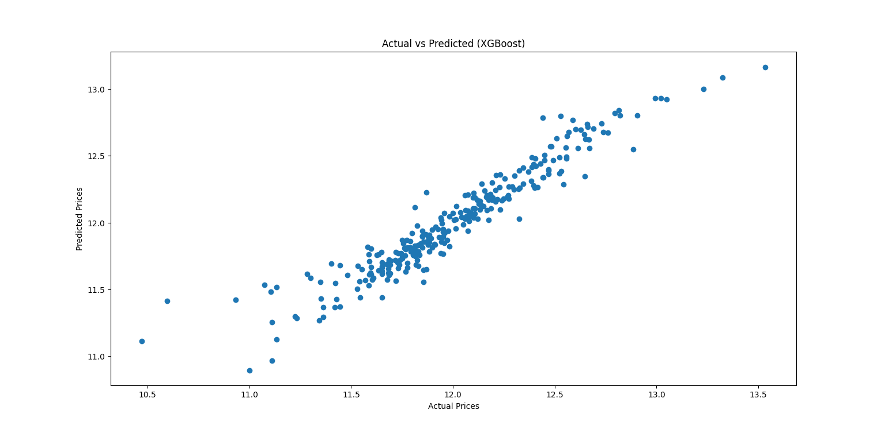
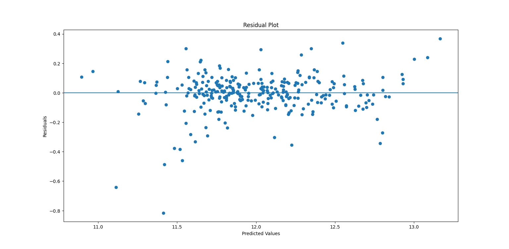
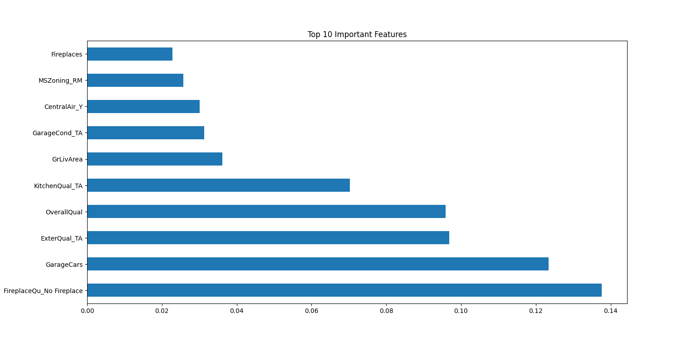

# House Price Prediction System

An end-to-end Machine Learning project that predicts house prices using regression models and deploys the best performing model using Streamlit.

---

## Project Overview

This project builds a regression-based ML system to predict house prices using the Kaggle House Prices dataset.

### Workflow:
- Data cleaning and preprocessing  
- Feature engineering  
- Model comparison (Linear Regression, Random Forest, XGBoost)  
- Cross-validation  
- Residual analysis  
- Feature importance interpretation  
- Deployment using Streamlit  

### Final Model Performance:
- R² Score (XGBoost): ~0.90  
- Low Mean Squared Error on log-transformed target  

---

## Models Used

| Model | Description |
|--------|------------|
| Linear Regression | Baseline regression model with feature scaling |
| Random Forest | Ensemble tree-based regressor |
| XGBoost | Gradient boosting model (Best performing) |

---

## Model Performance

### Cross Validation (Linear Regression)
Average CV Score ≈ 0.75  

### XGBoost
- R² ≈ 0.90  
- Strong generalization performance  

---

## Model Evaluation & Analysis

### Actual vs Predicted


### Residual Plot


### Feature Importance


These plots demonstrate:
- Good model fit  
- No severe bias patterns  
- Key impactful features such as Overall Quality and Living Area  

---

## Deployment

The model is deployed using Streamlit.

### Run Locally

```bash
pip install -r requirements.txt
streamlit run app.py

### Project  Structure

House-Price-Prediction-System/
│
├── app.py
├── house_Prediction.py
├── house_price_model.pkl
├── model_columns.pkl
├── train.csv
├── test.csv
├── Screenshots/
├── requirements.txt
├── README.md
└── LICENSE


### Technologies Used

Python

Pandas

NumPy

Scikit-learn

XGBoost

Matplotlib

Streamlit

Joblib

### Key Learnings

Importance of feature engineering in regression

Handling categorical encoding for deployment consistency

Preventing feature mismatch errors in production

Model interpretability using feature importance

Deployment of ML model as interactive web application

### Future Improvements

Hyperparameter tuning using GridSearchCV

Model pipeline saving (preprocessing + model together)

Public cloud deployment
